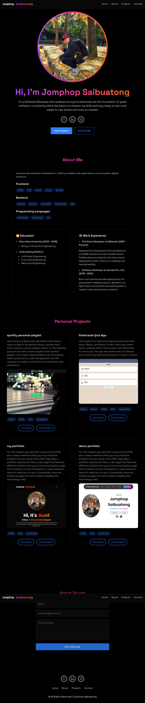

# 2morrowboyz Portfolio

A modern portfolio website crafted with **React**, **TypeScript**, **Tailwind CSS**, and **Vite**. This project showcases an interactive, responsive design to present personal projects, skills, and experiences. It features smooth navigation, animated sections, and optimized performance for a seamless user experience. The site demonstrates best practices in component architecture, state management, and styling with Tailwind, highlighting both technical proficiency and aesthetic sensibility.

## Demo

You can view a live demo of this portfolio project here:

[Live Demo Link](https://2morrowboyz-portfolio.netlify.app)

Or see example screenshots below:



## Features

- ⚡️ Fast development with Vite and HMR (Hot Module Replacement)
- 🛠️ TypeScript for type safety
- 🧹 ESLint with recommended and type-aware rules
- 📱 Responsive design with reusable components
- ✨ Animated sections and smooth scrolling
- 📦 Modular folder structure for scalability

## Project Structure

```
src/
  components/
    layouts/         # Navbar, Footer, MobileMenu
    sections/        # Home, About, Projects, Contact, RevealOnScroll
    shared/          # Loading, LoadingScreen
    lib/             # Utilities
    components/
      ui/            # UI utilities (e.g., sonner.tsx)
  hooks/             # Custom React hooks (e.g., useInView)
  utils/             # Common utilities and constants
  assets/            # Images and SVGs
public/              # Static files
configs/             # Project configuration files
```

## Getting Started

1. **Install dependencies:**

   ```sh
   npm install
   ```

2. **Run the development server:**

   ```sh
   npm run dev
   ```

3. **Build for production:**

   ```sh
   npm run build
   ```

4. **Preview the production build:**
   ```sh
   npm run preview
   ```

## Linting & Formatting

- ESLint is configured for both JavaScript and TypeScript, with recommended and type-aware rules.
- To lint your code:
  ```sh
  npm run lint
  ```

## Customization

- Update content in `src/components/sections/` for each section of your portfolio.
- Add or modify images in `src/assets/`.
- UI utilities can be found in `src/components/components/ui/`.
- Project configuration files are in `configs/`.

## Credits

- Built with [React](https://react.dev/), [TypeScript](https://www.typescriptlang.org/), and [Vite](https://vitejs.dev/).
- Inspired by modern portfolio best practices.
